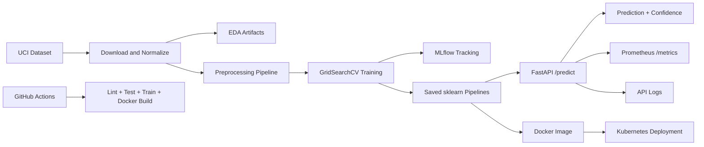

# Architecture Overview

The project follows a reproducible MLOps pipeline:

1. Data ingestion from the UCI Heart Disease Cleveland dataset
2. Dataset normalization, missing-value handling, scaling, and categorical encoding
3. Logistic Regression and Random Forest model training with GridSearchCV
4. Cross-validation and held-out test evaluation
5. Experiment logging with MLflow, including metrics, parameters, model artifacts, confusion matrices, and ROC curves
6. Model persistence as reusable sklearn pipelines
7. FastAPI prediction service with request logging and Prometheus metrics
8. Dockerized deployment and local Kubernetes exposure
9. CI/CD automation through GitHub Actions

## High-level flow

## Runtime flow

Client -> FastAPI API -> Saved preprocessing/model pipeline -> Prediction response

The preprocessing steps are stored inside the saved sklearn Pipeline, so inference uses the same imputation, scaling, and one-hot encoding learned during training.
