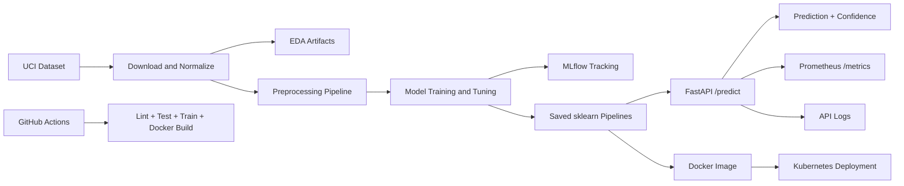

# Architecture Overview

This project follows a reproducible MLOps pipeline for heart disease prediction, from data preparation to deployment and monitoring.

## End-to-end flow

1. Data ingestion from the UCI Cleveland Heart Disease dataset.
2. Data preparation and normalization, including missing-value handling, scaling, and categorical encoding.
3. Model training and tuning for Logistic Regression and Random Forest using scikit-learn.
4. Evaluation using accuracy, precision, recall, F1-score, and ROC-AUC.
5. Experiment tracking with MLflow for parameters, metrics, plots, and saved model artifacts.
6. Model persistence as reusable sklearn pipelines for reproducible inference.
7. FastAPI-based prediction service with health, prediction, and metrics endpoints.
8. Containerization with Docker and deployment through Kubernetes manifests.
9. CI/CD automation with GitHub Actions for linting, tests, training, and Docker validation.
10. Monitoring with request logging and Prometheus-compatible metrics.

## High-level architecture

## Runtime flow

Client -> FastAPI API -> Saved preprocessing/model pipeline -> Prediction response

The preprocessing steps are embedded in the saved sklearn pipeline, so inference uses the same transformations learned during training.

## Component summary

- Data layer: scripts in the data pipeline download and prepare the dataset.
- Feature engineering layer: preprocessing and encoding logic are implemented in the feature engineering module.
- Model layer: training and evaluation logic are implemented in the model training module.
- Tracking layer: MLflow stores runs, metrics, parameters, plots, and artifacts.
- API layer: FastAPI provides health checks, prediction requests, and metrics exposure.
- Deployment layer: Docker and Kubernetes package and expose the service.
- Automation layer: GitHub Actions validates the repository on push and pull request.

## API endpoints

- GET /health: returns service health information.
- POST /predict: accepts patient features and returns a prediction with confidence.
- GET /metrics: exposes Prometheus-compatible metrics.
