# Student Details

- **Name:** Shyam Gupta
- **ID:** 2024CS05012
- **Course:** MLOps (S2-25_AMLCSZG523)
- **Assignment 01:** End-to-End ML Model Development, CI/CD, and Production Deployment Experimental Learning
- **Total Marks:** 50

---

## Submission Details

| Artifact | Location |
| --- | --- |
| **Public GitHub repository** | <https://github.com/2024CS05012/MLOps-Heart-Disease> |
| **Demo video (Google Drive)** | <> |
| **CI/CD workflow** | <https://github.com/2024CS05012/MLOps-Heart-Disease/actions> |

---

# 1. Problem Statement & Dataset

**Problem:** Design, develop, and deploy a scalable, reproducible machine learning
solution using modern MLOps best practices. The assignment emphasizes practical
automation, experiment tracking, CI/CD pipelines, containerization, cloud deployment,
and monitoring, mirroring real-world production scenarios.

**Dataset:**  Title: Heart Disease UCI Dataset
- Source: [UCI Machine Learning Repository](https://archive.ics.uci.edu/dataset/45/heart+disease)
- CSV containing 14+ features (age, sex, blood pressure, cholesterol, etc.) and a
binary target (presence/absence of heart disease).

| Feature | Type | Description |
| --- | --- | --- |
| age | numeric | Patient age (years) |
| sex | categorical (0/1) | 1 = male, 0 = female |
| cp | categorical (0–3) | Chest pain type |
| trestbps | numeric | Resting blood pressure (mm Hg) |
| chol | numeric | Serum cholesterol (mg/dl) |
| fbs | categorical | Fasting blood sugar > 120 mg/dl |
| restecg | categorical | Resting ECG result |
| thalach | numeric | Max heart rate achieved |
| exang | categorical | Exercise-induced angina |
| oldpeak | numeric | ST depression |
| slope | categorical | Slope of peak ST segment |
| ca | numeric | Number of major vessels colored by fluoroscopy |
| thal | categorical | Thalassemia indicator |
| target | binary | 1 = heart disease, 0 = none |

## 2. Project Overview

This project implements an end-to-end MLOps workflow for predicting the risk of
heart disease from patient clinical data. The solution uses the UCI Cleveland
Heart Disease dataset and covers data acquisition, EDA, preprocessing, model
training, experiment tracking, reproducible model packaging, API serving,
containerization, CI/CD, Kubernetes deployment, and monitoring.

The final application exposes a FastAPI prediction API that accepts patient
features as JSON and returns a binary heart disease prediction with a confidence
score.

## 3. Setup and Installation

The complete setup and execution instructions are provided in:

- `docs/SETUP.md`

Main setup commands:

```bash
python3.11 -m venv .venv
source .venv/bin/activate
pip install -r requirements.txt
```

The project can be verified locally using Python, Docker Desktop, Docker
Compose, and Docker Desktop Kubernetes.

## 4. Dataset

Dataset: Heart Disease UCI Dataset, Cleveland processed dataset.

The dataset is downloaded using:

```bash
python data/raw/download_dataset.py
```

The original UCI target represents disease severity from 0 to 4. For this
binary classification problem, target value 0 is treated as no heart disease and
values 1 to 4 are mapped to heart disease.

Final features include age, sex, chest pain type, resting blood pressure,
cholesterol, fasting blood sugar, resting ECG, maximum heart rate,
exercise-induced angina, ST depression, slope, number of major vessels, and
thalassemia category.

## 5. Exploratory Data Analysis

EDA artifacts are generated with:

```bash
python -m src.data.generate_eda_artifacts
```

The EDA includes:

- Numeric feature histograms
- Missing-value analysis
- Class distribution
- Correlation heatmap
- Maximum heart rate relationship by target class

Generated EDA files:

- `artifacts/eda/feature_histograms.png`
- `artifacts/eda/missing_values.png`
- `artifacts/eda/class_distribution.png`
- `artifacts/eda/correlation_heatmap.png`
- `artifacts/eda/thalach_by_target.png`

Captured screenshots:

- 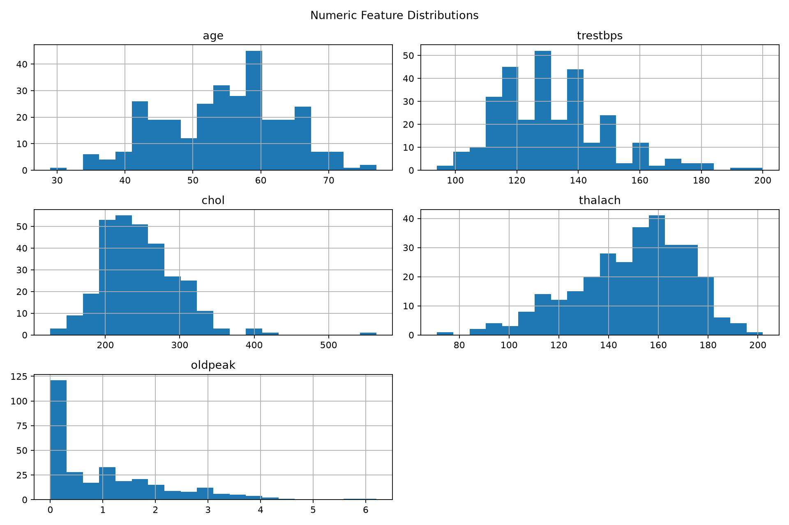
- 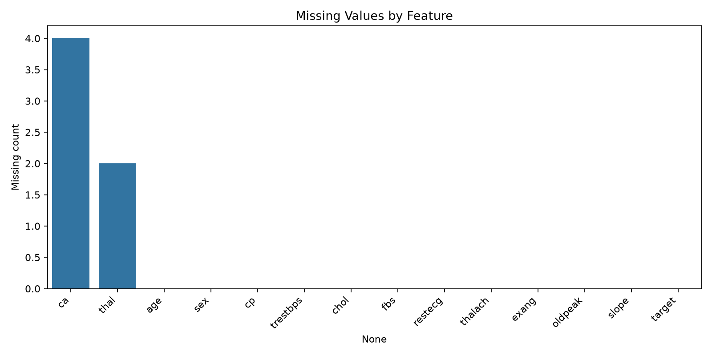
- 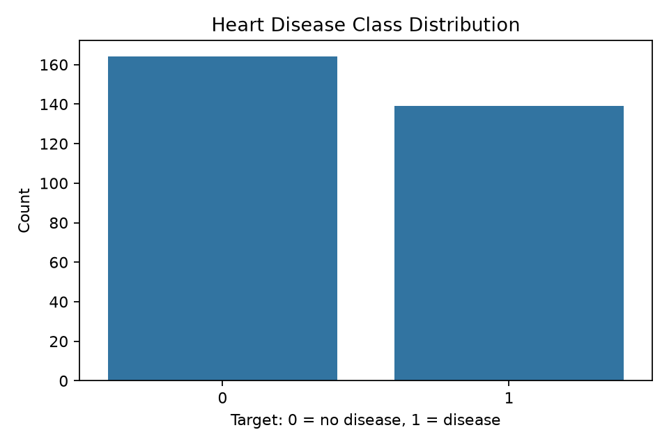
- 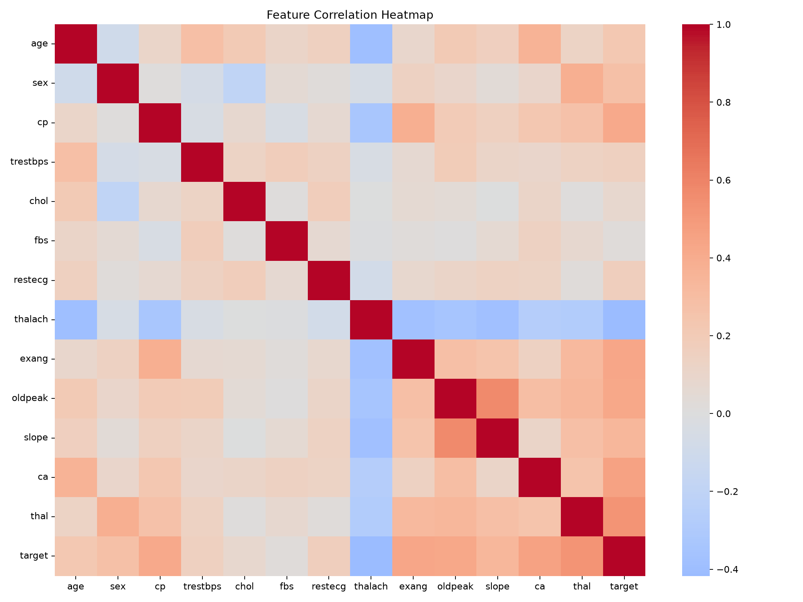
- 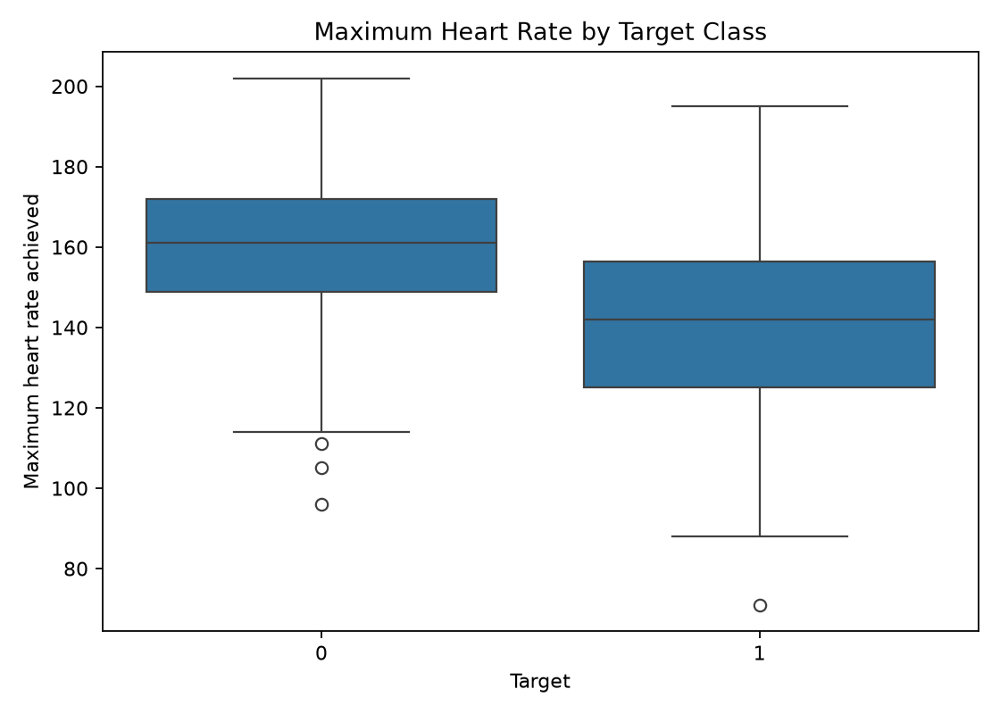

## 6. Preprocessing and Feature Engineering

The project uses a reusable sklearn preprocessing pipeline defined in
`src/features/engineering.py`.

Preprocessing choices:

- Missing numeric values are imputed using the median.
- Numeric features are scaled with `StandardScaler`.
- Missing categorical values are imputed using the most frequent value.
- Categorical features are encoded with `OneHotEncoder`.
- Preprocessing is stored inside the final sklearn `Pipeline`, so training and
  inference use the same transformations.

This satisfies reproducibility because the saved model artifact includes both
feature transformations and the trained classifier.

## 7. Model Development

Two classification models are trained:

- Logistic Regression
- Random Forest

Training is implemented in `src/models/train.py`.

Training command:

```bash
python -m src.models.train
```

Model selection and tuning:

- Each model is wrapped in an sklearn `Pipeline`.
- Hyperparameter tuning is performed using `GridSearchCV`.
- Stratified cross-validation is used to preserve class balance across folds.
- ROC-AUC is used as the grid-search optimization score.

Evaluation metrics:

- Accuracy
- Precision
- Recall
- F1-score
- ROC-AUC
- Cross-validation metric averages

Current generated classification report summary:

| Model | Accuracy | Weighted Precision | Weighted Recall | Weighted F1 |
|---|---:|---:|---:|---:|
| Logistic Regression | 0.8852 | 0.8899 | 0.8852 | 0.8854 |
| Random Forest | 0.8689 | 0.8711 | 0.8689 | 0.8691 |

Evaluation artifacts:

- `artifacts/logistic_regression/classification_report.json`
- `artifacts/logistic_regression/confusion_matrix.png`
- `artifacts/logistic_regression/roc_curve.png`
- `artifacts/random_forest/classification_report.json`
- `artifacts/random_forest/confusion_matrix.png`
- `artifacts/random_forest/roc_curve.png`

Captured screenshots:

- 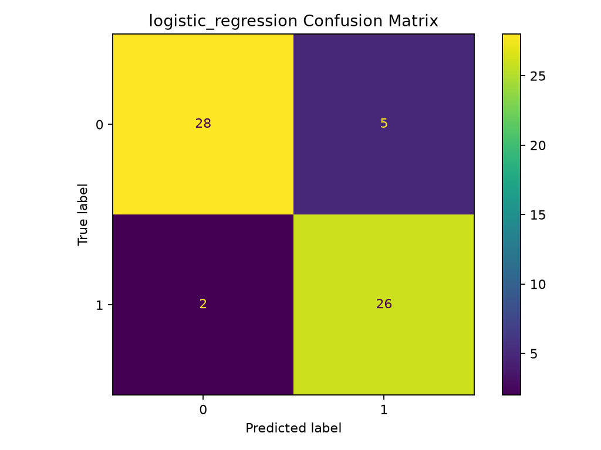
- 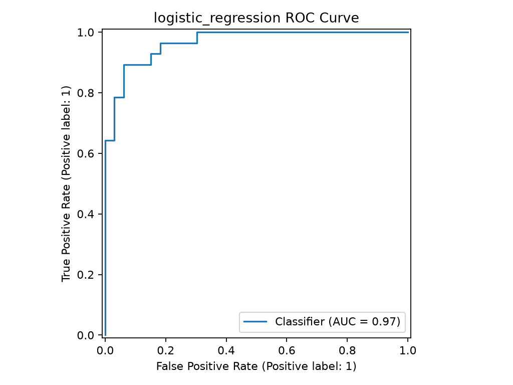
- 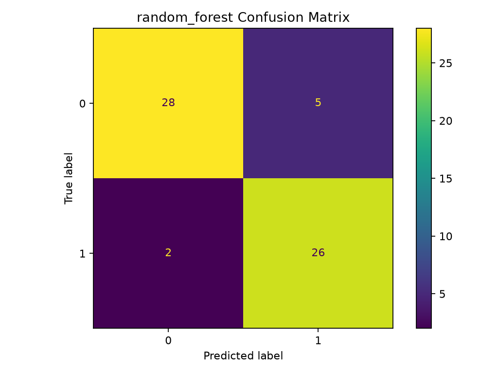
- 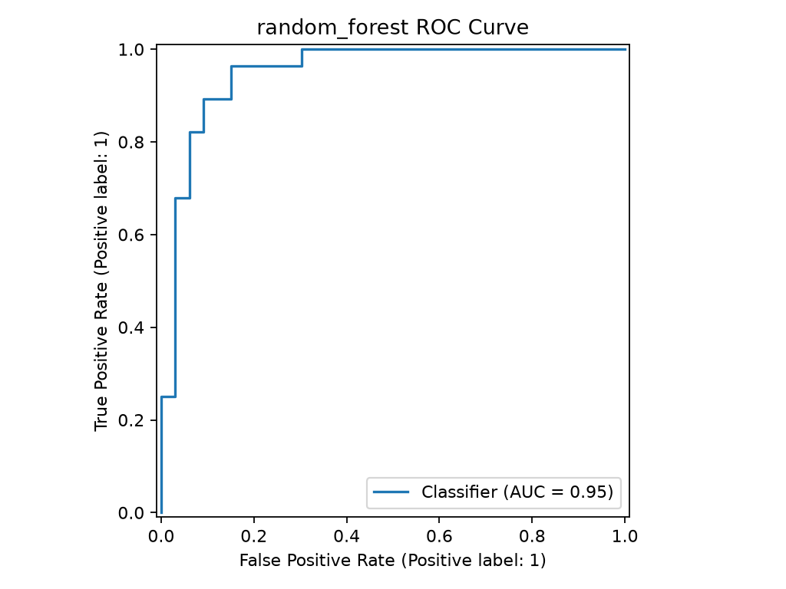

## 8. Experiment Tracking

MLflow is used for experiment tracking. The MLflow integration is implemented
in `src/models/mlflow_utils.py`.

MLflow tracks:

- Model name
- Best hyperparameters
- Accuracy, precision, recall, F1-score, ROC-AUC
- Cross-validation metrics
- Confusion matrix images
- ROC curve images
- Classification reports
- Saved joblib model artifacts
- Serialized sklearn model artifacts

Start the MLflow UI with:

```bash
mlflow ui --backend-store-uri sqlite:///mlruns/mlflow.db
```

Then open:

- http://127.0.0.1:5000

Captured screenshots:

- 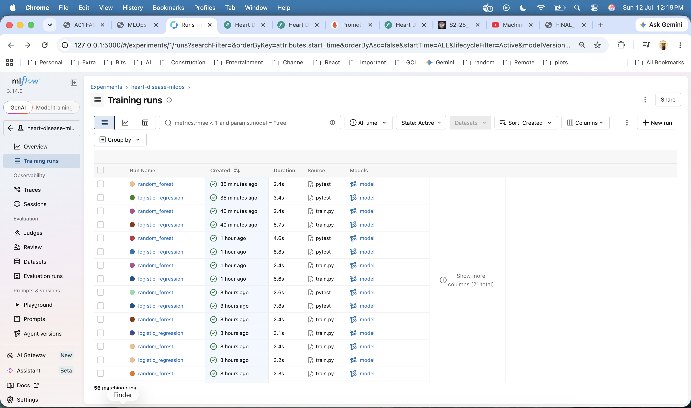
- 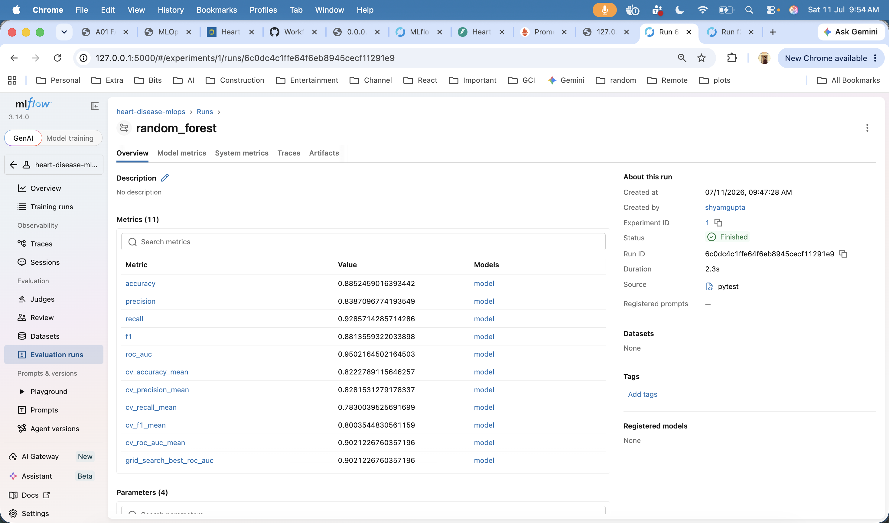
- 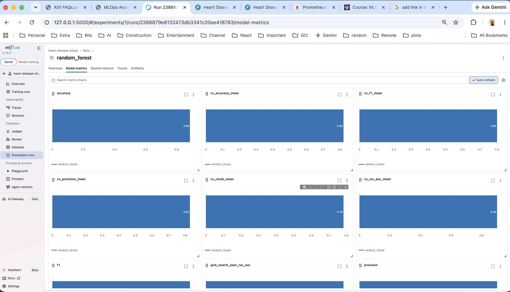
- 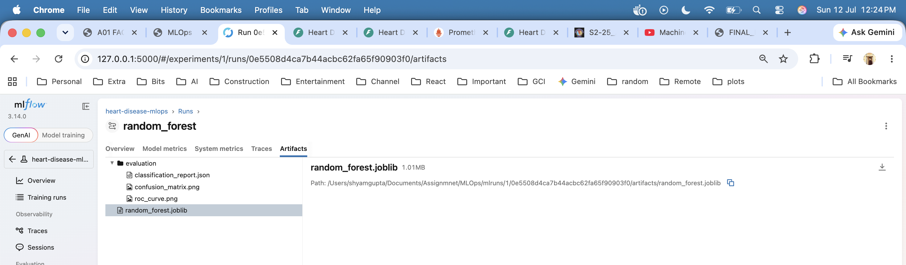

## 9. Model Packaging and Reproducibility

The final models are saved in reusable joblib format:

- `models/logistic_regression.joblib`
- `models/random_forest.joblib`

The saved artifacts are sklearn pipelines, so they include both preprocessing
and the trained classifier. This ensures the API uses the same preprocessing
logic that was used during model training.

Reproducibility files:

- `requirements.txt`
- `src/features/engineering.py`
- `src/models/train.py`
- `models/*.joblib`
- `docs/SETUP.md`

## 10. API Serving

The model is served using FastAPI in `src/api/main.py`.

Endpoints:

- `GET /health`
- `POST /predict`
- `GET /metrics`

The `/predict` endpoint accepts JSON input and returns:

- `prediction`: binary class prediction
- `confidence`: maximum predicted class probability

Sample request:

```bash
curl -X POST http://127.0.0.1:8000/predict \
  -H "Content-Type: application/json" \
  -d '{"age":63,"sex":1,"cp":3,"trestbps":145,"chol":233,"fbs":1,"restecg":0,"thalach":150,"exang":0,"oldpeak":2.3,"slope":0,"ca":0,"thal":1}'
```

Captured screenshot:

- 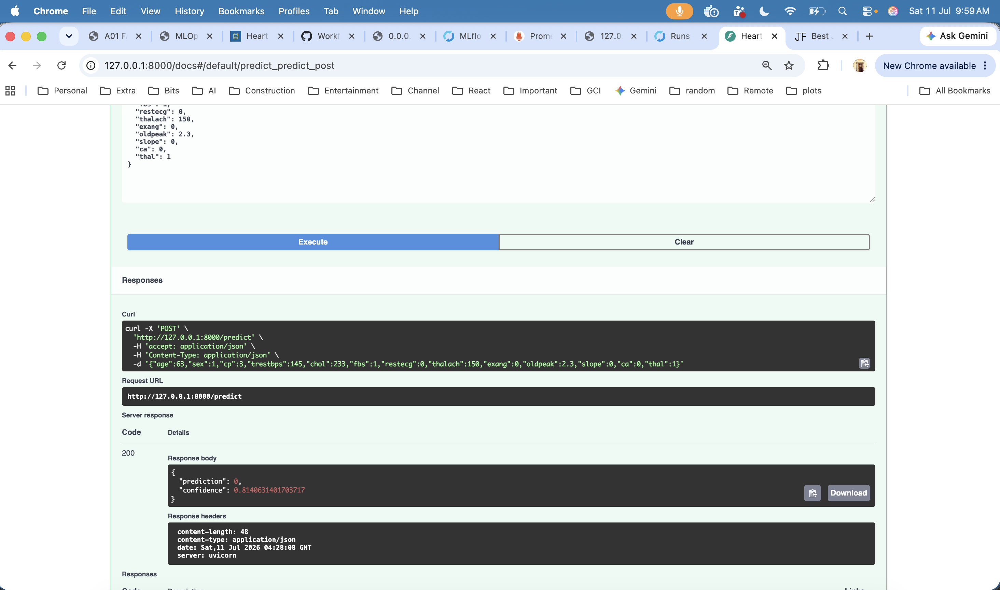

## 11. Containerization

The API is containerized using Docker.

Build and run:

```bash
docker build -f docker/Dockerfile -t heart-disease-api:local .
docker run --rm -p 8000:8000 --name heart-disease-api heart-disease-api:local
```

Verify:

```bash
curl http://127.0.0.1:8000/health
```

Captured screenshots:

- 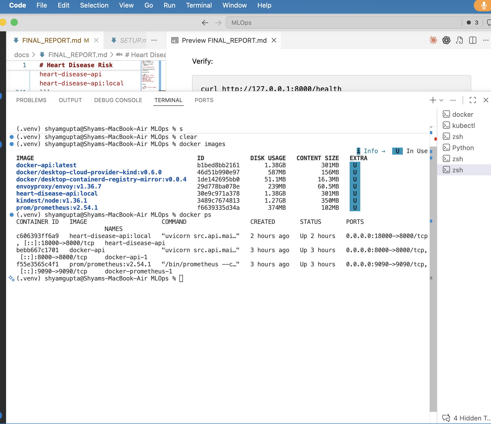
- 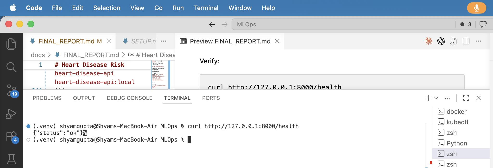

## 12. CI/CD Pipeline

GitHub Actions is configured in `.github/workflows/ci.yml`.

The workflow runs on push and pull request. It performs:

- Dependency installation
- Ruff linting
- Dataset download
- EDA artifact generation
- Model training
- Pytest test suite
- Docker build validation

This ensures the pipeline fails clearly if code quality checks, tests, training,
or Docker build validation fail.

Captured screenshot:

- 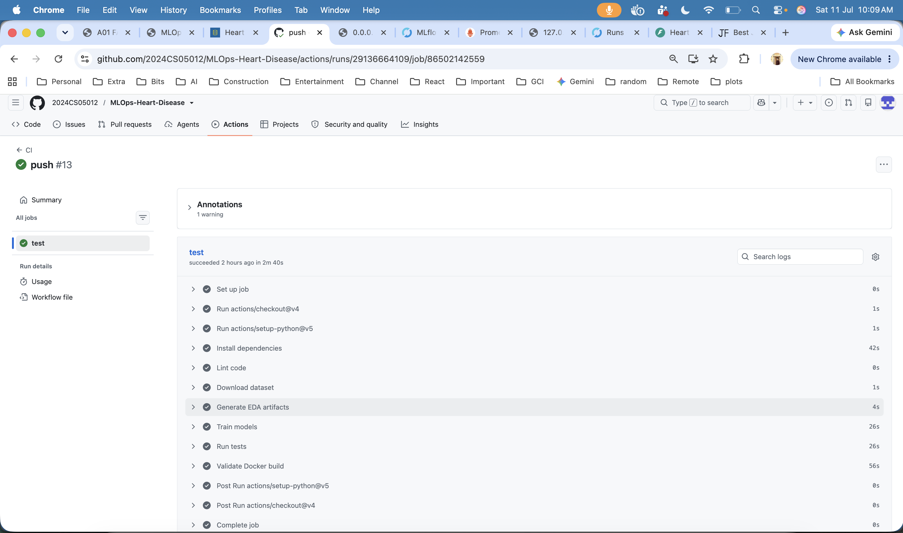

## 13. Kubernetes Deployment

Kubernetes deployment is defined in `k8s/deployment.yaml`.

The manifest includes:

- Deployment for the FastAPI container
- Readiness probe on `/health`
- Liveness probe on `/health`
- LoadBalancer service exposing port 8000

Docker Desktop Kubernetes deployment commands:

```bash
docker build -f docker/Dockerfile -t heart-disease-api:local .
kubectl apply -f k8s/deployment.yaml
kubectl rollout status deployment/heart-disease-api
kubectl get pods
kubectl get svc heart-disease-api-service
kubectl port-forward svc/heart-disease-api-service 18000:8000
```

Verify:

```bash
curl http://127.0.0.1:18000/health
```

Captured screenshots:

- 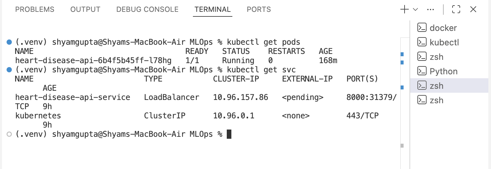
- 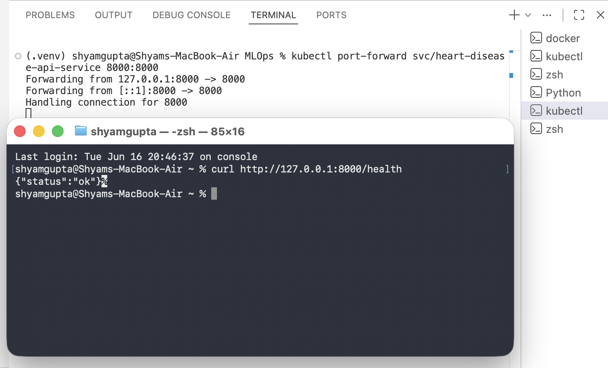

## 14. Monitoring and Logging

Monitoring and logging are implemented with FastAPI request logging and
Prometheus-compatible metrics.

Implemented monitoring/logging:

- API request logs include method, path, status code, and duration.
- `/metrics` exposes Prometheus metrics.
- `monitoring/prometheus.yml` configures Prometheus to scrape the API service.
- `docker/docker-compose.yml` starts the API and Prometheus together.

Run:

```bash
docker compose -f docker/docker-compose.yml up -d --build
```

Verify metrics:

```bash
curl http://127.0.0.1:8000/metrics
curl http://127.0.0.1:9090/api/v1/targets
```

Captured screenshots:

- 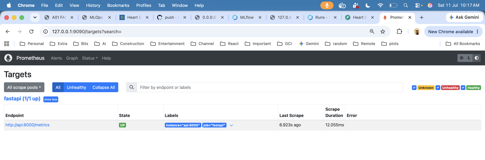
- 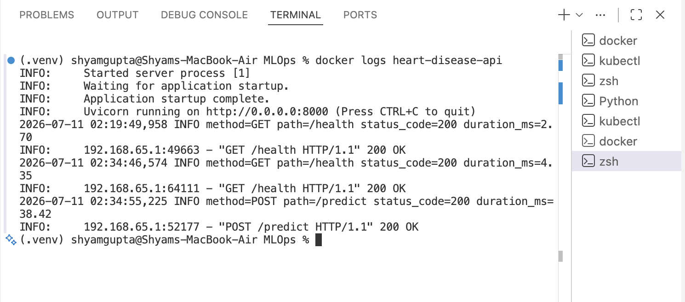

## 15. Architecture

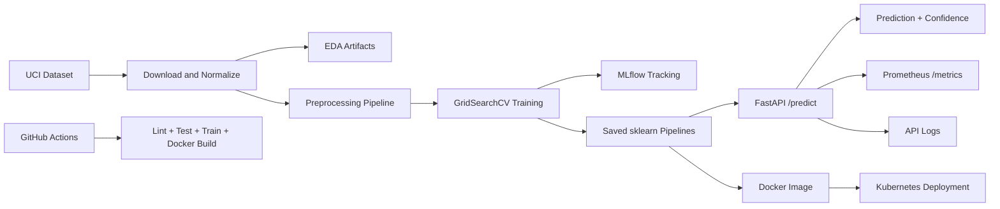
```mermaid
flowchart LR
    A[UCI Dataset] --> B[Download and Normalize]
    B --> C[EDA Artifacts]
    B --> D[Preprocessing Pipeline]
    D --> E[GridSearchCV Training]
    E --> F[MLflow Tracking]
    E --> G[Saved sklearn Pipelines]
    G --> H[FastAPI /predict]
    H --> I[Prediction + Confidence]
    H --> J[Prometheus /metrics]
    H --> K[API Logs]
    G --> L[Docker Image]
    L --> M[Kubernetes Deployment]
    N[GitHub Actions] --> O[Lint + Test + Train + Docker Build]
```

## 16. Final Submission Checklist

- Code repository link included.
- Setup instructions included in `docs/SETUP.md`.
- EDA artifacts generated.
- Two tuned models trained and evaluated.
- MLflow runs logged.
- Models saved as reusable sklearn pipelines.
- Unit tests and CI/CD workflow included.
- Docker container builds and serves the API locally.
- Kubernetes deployment manifest included and tested locally.
- Monitoring through API logs and Prometheus metrics included.
- Screenshots added under `screenshots/`.
- Final Markdown report exported to PDF.
